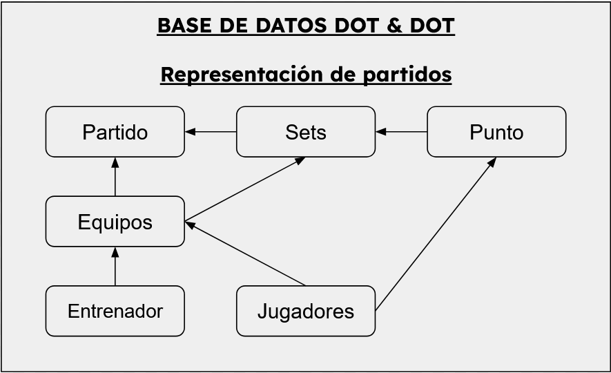

# Diseño del Backend multimodal para los distintos Frontends de la aplicación DOT & DOT

## Idea 

Para comenzar éste apartado, comenzaré con el leitmotiv. Principalmente se desarolla con el objetivo de ser el árbitro de las comunicaciones de este sistema de aplicaciones. Para ello, esta aplicación se encargará de cara al exterior de lo siguiente:
  1. Registrar y autorizar las altas de los usuarios. Que estarán a cargo de los administradores.
  2. Situar las barreras de los roles con los que la aplicación cuenta.
  3. Manejar el almacenamiento, modificación y mostrado de los distintos partidos.
  4. Definir si los dispositivos que acceden a la aplicación son válidos o no.

Y de puertas a dentro manejará lo siguiente:
  1. Persistencia y verificación de la integridad de los datos.
  2. Comunicaciones con el sistema de bases de datos.
  3. Acciones permitidas o prohibidas.

## Comienzo

Yendo en este apartado a detalles más concretos, comenzaré con una vista general del sistema de backend.
Para ello, situaremos 4 áreas a mencionar:
  1. Partidos.
  2. Usuarios.
  3. Público.
  4. Páginas web.

### Partidos

Como tema principal de la aplicación tenemos el manejo de los partidos de voleibol. Para ello, se desarrollará una estructura que contará con los distintos endpoint con los que se arbitrará desde dispositivos móviles (tablets).

Sitúo entonces el diagrama que se incluye en la propuesta del proyecto para un desarrollo más extenso y detallado de su implementación.



Cómo se ve en el diagrama, compondremos la estructura del flujo de los partidos de:

Partido:
- Equipos:
  - Entrenadores
  - Jugadores

- Sets
  - Equipo:
    - Entrenadores
    - Jugadores
  - Puntos:
    - Jugador que lo marca

#### ¿Por qué se elige esta estructura?

```
Esta estructura se elige debido a que el objetivo de la aplicación es acercar el arbitraje más estricto al nivel más básico del voleibol. Para ello, se compone un sólo objeto denominado: Partido; que se compone de: Sets y Equipos (En un partido real de voleibol son los datos más importantes del acta real); que a su vez se componen de lo especificado en el esquema anterior. 
```

#### Detallaje en lenguaje java

Acorde a lo mentado anteriormente, las distintas clases tendrán las siguientes estructuras:

Jugador (desciende de la clase Persona):
- Atributos de la clase Persona (Explicados más adelante).
- Número de la camiseta (Predeterminado).
- ID del equipo al que pertenece.
- Categoría.

Entrenador (desciende de la clase Persona):
- Atributos de la clase Persona (Explicados más adelante).
- Número de licencia.
- Nivel de licencia.
- ID del equipo al que pertenece.

Técnico (Ampliación. Desciende de la clase Persona):
- Atributos de la clase Persona (Explicados más adelante).
- Función.

Equipo:
- Lista de Entrenadores.
- Lista de Cuerpo técnico.
- Lista de Jugadores.
- Nombre.
- Localidad.

Cancha (Ampliación necesaria para el almacenaje dentro del partido): 
- Nombre.
- Localidad.
- Dirección.
