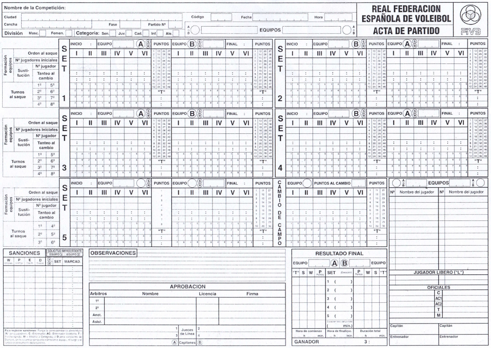
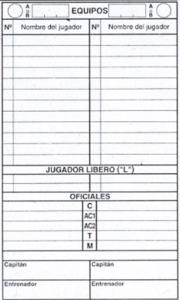
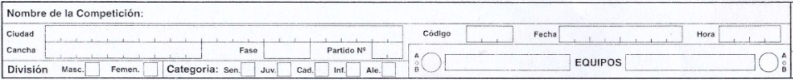
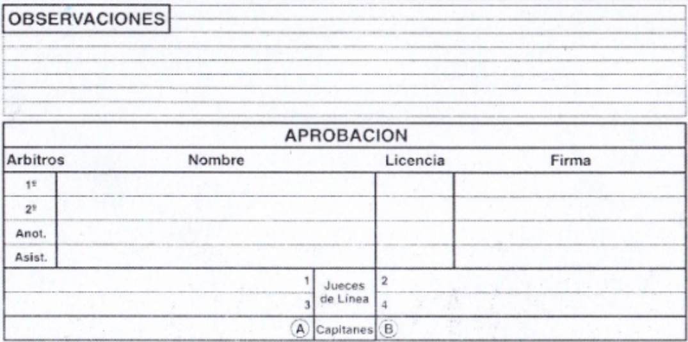
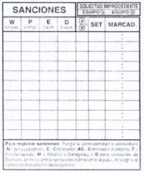
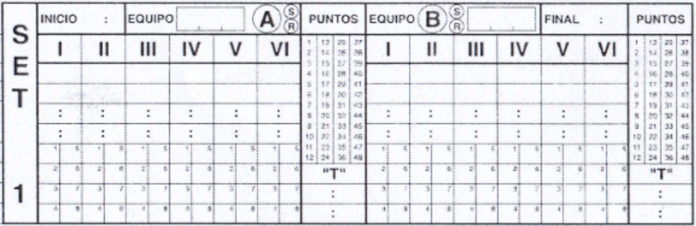
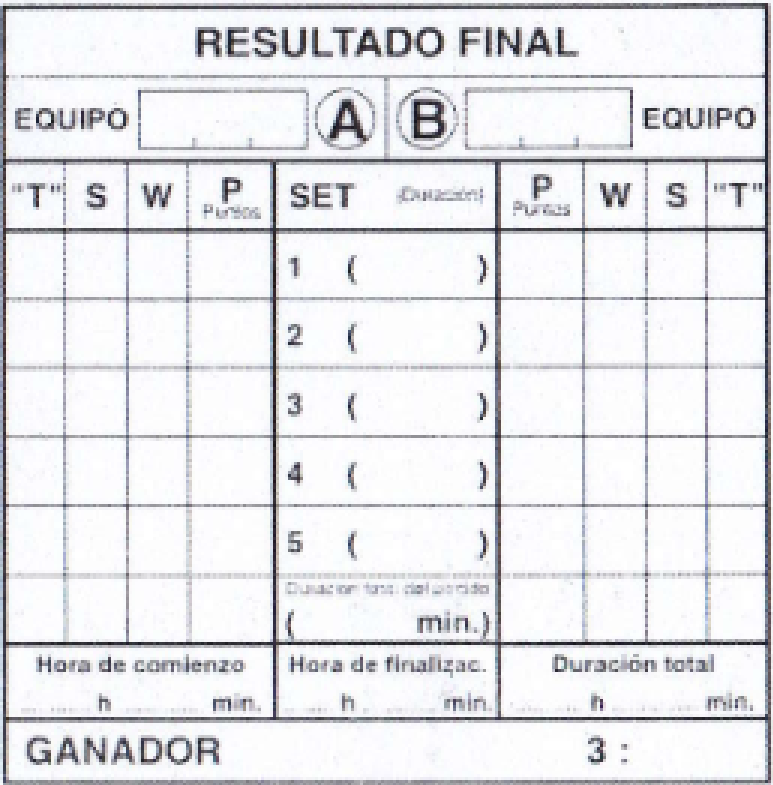

# Diseño del Backend multimodal para los distintos Frontends de la aplicación DOT & DOT

## Idea 

Para comenzar éste apartado, comenzaré con el leitmotiv. Principalmente se desarolla con el objetivo de ser el árbitro de las comunicaciones de este sistema de aplicaciones. Para ello, esta aplicación se encargará de cara al exterior de lo siguiente:
  1. Registrar y autorizar las altas de los usuarios. Que estarán a cargo de los administradores.
  2. Situar las barreras de los roles con los que la aplicación cuenta.
  3. Manejar el almacenamiento, modificación y mostrado de los distintos partidos.
  4. Definir si los dispositivos que acceden a la aplicación son válidos o no.

Y de puertas a dentro manejará lo siguiente:
  1. Persistencia y verificación de la integridad de los datos.
  2. Comunicaciones con el sistema de bases de datos.
  3. Acciones permitidas o prohibidas.

## Comienzo

Yendo en este apartado a detalles más concretos, comenzaré con una vista general del sistema de backend.
Para ello, situaremos 4 áreas a mencionar:
  1. Partidos.
  2. Usuarios.
  3. Público.
  4. Páginas web.


<div style="page-break-after: always;"></div>

# Partidos

Como tema principal de la aplicación tenemos el manejo de los partidos de voleibol. Para ello, se desarrollará una estructura que contará con los distintos endpoint con los que se arbitrará desde dispositivos móviles (tablets).

En base a lo anterior se intenta desplegar una estructura que consiga el mismo desarrollo que el acta real.



Sitúo entonces el diagrama que se incluye en la propuesta del proyecto para un desarrollo más extenso y detallado de su implementación.


<div style="page-break-after: always;"></div>

Cómo se ve en el diagrama, compondremos la estructura del flujo de los partidos de:

Partido:
- Equipos:
  - Entrenadores
  - Jugadores

- Sets
  - Equipo:
    - Entrenadores
    - Jugadores
  - Puntos:
    - Jugador que lo marca

Esta es la estructura de la propuesta, qué se presenta como una aproximación.

#### ¿Por qué se elige esta estructura?

```
Esta estructura se elige debido a que el objetivo de la aplicación es acercar el arbitraje más estricto al nivel más básico del voleibol. Para ello, se compone un sólo objeto denominado: Partido; que se compone de: Sets y Equipos (En un partido real de voleibol son los datos más importantes del acta real); que a su vez se componen de lo especificado en el esquema anterior. 
```

<div style="page-break-after: always;"></div>

# Detallaje en lenguaje java

En base a la idea y propuesta se amplían las necesidades concretas detalladas aquí:

Persona:
- DNI.
- Nombre.
- Apellidos.
- Fecha de nacimiento.
- Dirección.
- Teléfono.
- Email.
- DNI verificado (Booleano).
- Tutelado (Booleano).
- DNI del Tutor (Otra persona).

## Equipos



Jugador (desciende de la clase Persona):
- Atributos de la clase Persona.
- Número de la camiseta (Predeterminado).
- ID del equipo al que pertenece.
- Categoría.

Entrenador (desciende de la clase Persona):
- Atributos de la clase Persona.
- Número de licencia.
- Nivel de licencia.
- ID del equipo al que pertenece.

Técnico (Ampliación. Desciende de la clase Persona):
- Atributos de la clase Persona.
- Número de licencia.
- Función.
- ID del equipo al que pertenece.

Equipo:
- Lista de Entrenadores (Máximo 3).
- Lista de Cuerpo técnico.
- Lista de Jugadores.
- Capitán (Por defecto).
- Nombre.
- Id del Club.
- Categoría.

Equipo en partido (Hereda de Equipo):
- Atributos de Equipo.
- Capitán (En caso de ser distinto al por defecto).
- Lista de jugadores que faltan al partido.

Club:
- Nombre.
- Id de la ciudad.

<div style="page-break-after: always;"></div>

## Datos



Ciudad:
- Nombre.
- Región.
- Rango CP.

Cancha: 
- Nombre.
- Id de la ciudad.
- Dirección.
- Número de pistas posibles.

Detalles del Partido:
- Código de identificación único.
- Nombre de la competición.
- Id de la ciudad.
- División.
- Categoría.
- Situación de inicio.

Situación de inicio:
- Equipo local.
- Equipo visitante.
- Equipo que saca.
- Equipo que recibe.
- Equipo situado en la izquierda.
- Equipo situado en la derecha.

<div style="page-break-after: always;"></div>

## Arbitraje



Árbitro:
- Atributos de la clase Persona.
- Número de la licencia.
- Nivel de la Licencia.
- Id de la Ciudad.

Equipo Arbitral:
- Árbitro principal.
- Lista de árbitros asistentes.

Observaciones:
- Lista de Observaciones.

## Sanciones



Sanción:
- Tipo (Nº -> Jugador, C -> Entrenador, AC -> Entrenador asistente, T -> Téc. Fisioterapeuta, M -> Médico o Delegado, I -> Solicitud improcedente, D -> Demora (colectiva))
- Equipo que causa.
- Marcador.

<div style="page-break-after: always;"></div>

## Sets



Set:
- Situación de inicio.
- Hora de inicio.
- Hora de fin.
- Alineaciones.
- Tiempos muertos.

Alineación:
- Jugador en cada posición.
- Número de rotaciones.
- Cambios.

Punto:
- Jugador que lo marca.
- Número del punto.

<div style="page-break-after: always;"></div>

## Resultados



Resultado:
- Lista de Sets.
- Equipo ganador.
- Equipo perdedor.
- Hora inicio.
- Hora fin.
- Duración.
- Puntaje.

Puntaje:
- Puntos a favor de un equipo.
- Puntos a favor del otro equipo.
- Resultado.

<div style="page-break-after: always;"></div>

# Sistema de usuarios

Para el sistema de usuarios utilizaré la librería de Spring Security. Para ello crearé en principio los roles de:
- ADMIN
- PUBLIC
- PLAYER
- REFEREE
- COACH

Cada uno de estos roles tendrá diferentes niveles de acceso y permisos dentro de la aplicación:

- **ADMIN**: Tiene control total sobre la plataforma. Puede crear, modificar y eliminar usuarios, gestionar partidos y modificar configuraciones del sistema.
- **PUBLIC**: Solo tiene acceso a información pública, como resultados de partidos y estadísticas generales.
- **PLAYER**: Puede acceder a su perfil, ver estadísticas personales y consultar información relevante de su equipo.
- **REFEREE**: Puede gestionar partidos, registrar sanciones y validar resultados.
- **COACH**: Puede gestionar su equipo, modificar alineaciones y consultar estadísticas de sus jugadores.

## Autenticación y Autorización

La autenticación de usuarios se realizará mediante tokens JWT. Se implementará un sistema de registro y login seguro con cifrado de contraseñas utilizando BCrypt.

### Endpoints para autenticación:
1. **`/auth/register`** → Permite a los administradores registrar nuevos usuarios.
2. **`/auth/login`** → Devuelve un token JWT si las credenciales son correctas.
3. **`/auth/logout`** → Invalida el token actual.

## Gestión de Usuarios

Para gestionar los usuarios, se utilizarán los siguientes endpoints:

1. **`/users`** (GET) → Devuelve la lista de usuarios registrados.
2. **`/users/{id}`** (GET) → Devuelve la información de un usuario específico.
3. **`/users/{id}`** (PUT) → Permite modificar los datos de un usuario.
4. **`/users/{id}`** (DELETE) → Elimina un usuario del sistema.

## Seguridad y Control de Acceso

Para reforzar la seguridad, se implementarán medidas adicionales como:
- **CORS Policy**: Para restringir accesos no autorizados desde otros dominios.
- **Rate Limiting**: Para evitar ataques de fuerza bruta en los endpoints de autenticación.
- **Logs de Actividad**: Registro de eventos de acceso, modificaciones y eliminaciones de datos.

---

# Público

El público tendrá acceso a la información pública de los partidos y estadísticas sin necesidad de autenticarse. Para ello, se desarrollarán los siguientes endpoints:

1. **`/public/matches`** (GET) → Lista de partidos disponibles con resultados y detalles básicos.
2. **`/public/match/{id}`** (GET) → Información detallada de un partido específico.
3. **`/public/standings`** (GET) → Clasificación y estadísticas de equipos y jugadores.

Además, se podrán implementar filtros y opciones de búsqueda para que el público pueda encontrar información relevante de manera rápida y eficiente.

---

# Páginas web

Para la interacción web, se desarrollarán interfaces adaptadas a diferentes tipos de usuarios:

- **Página pública**: Información sobre la aplicación, calendario de partidos y acceso a estadísticas.
- **Panel de administración**: Gestión de usuarios, equipos, partidos y configuración del sistema.
- **Área de árbitros**: Registro de sanciones, control de partidos en tiempo real y validación de resultados.
- **Portal de jugadores y entrenadores**: Consulta de estadísticas, gestión de equipos y análisis de rendimiento.

Estas interfaces se desarrollarán con tecnologías modernas como React o Angular para ofrecer una experiencia fluida e intuitiva.

---

# Conclusión

El backend multimodal para la aplicación DOT & DOT ha sido diseñado para ser seguro, escalable y flexible, permitiendo la integración con distintos frontends y dispositivos. Se ha establecido una estructura clara para la gestión de partidos, usuarios, arbitraje y resultados, asegurando la integridad de los datos y un acceso controlado basado en roles.

El uso de Spring Boot junto con Spring Security proporcionará una arquitectura robusta, mientras que la utilización de JWT garantizará una autenticación segura y eficiente. Este sistema permitirá una experiencia optimizada para administradores, árbitros, jugadores y entrenadores, acercando el arbitraje digital al voleibol de una manera profesional y precisa.